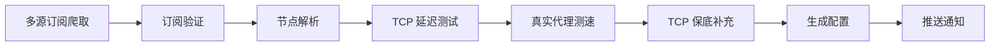

# 🚀 Clash 节点筛选器 - 完整文档

<div align="center">

[](https://github.com/litywang/ZRONG/stargazers)
[](https://github.com/litywang/ZRONG/network/members)
[](https://github.com/litywang/ZRONG/issues)
[](https://github.com/litywang/ZRONG/blob/main/LICENSE)
[](https://github.com/litywang/ZRONG/actions)

**基于 wzdnzd/aggregator 核心功能整合 · 支持 11 种协议 · 真实代理测速**

[功能特性](#-功能特性) • [快速开始](#-快速开始) • [配置说明](#-配置说明) • [常见问题](#-常见问题)

</div>

---

## 📖 项目简介

本项目是一个**全自动的 Clash 节点筛选系统**，整合了 [wzdnzd/aggregator](https://github.com/wzdnzd/aggregator) 的核心功能，通过 GitHub Actions 定时运行，自动爬取、验证、测速并输出可用的代理节点配置。

### 核心优势

| 特性 | 说明 |
|------|------|
| 🌐 **多源爬取** | Google/Yandex/Telegram/Twitter/GitHub/网页 多源订阅爬取 |
| ✅ **完整验证** | 订阅流量/过期时间/15MB 限制读取 (借鉴 wzdnzd/aggregator) |
| 🔌 **11 协议支持** | VMess/VLESS/Trojan/SS/SSR/Hysteria2/Hysteria/TUIC/Snell/HTTP/SOCKS |
| ⚡ **真实测速** | 通过 Clash.Meta 内核进行真实代理连接测试 |
| 🛡️ **503 解决** | 速率限制 + 自动重试 + 递增等待，彻底解决 Backend.max_conn 错误 |
| 🎯 **TCP 保底** | 测速失败时自动使用 TCP 延迟补充，确保有可用节点 |
| 🎨 **智能命名** | 特殊字体 + 地区标识 + 延迟/速度显示 |

---

## ✨ 功能特性

### 📡 支持的协议

```
✅ VMess      ✅ VLESS      ✅ Trojan
✅ Shadowsocks (SS)         ✅ ShadowsocksR (SSR)
✅ Hysteria2  ✅ Hysteria   ✅ TUIC
✅ Snell      ✅ HTTP       ✅ SOCKS
```

### 🔄 工作流程



### 📊 预期效果

| 指标 | 预期值 |
|------|--------|
| 原始节点 | 3000-5000 个 |
| TCP 合格 | 500-800 个 |
| 最终可用 | 100-200 个 |
| 亚洲节点 | 30-50% |
| 运行时间 | 300-500 秒 |

---

## 🚀 快速开始

### 1️⃣ Fork 仓库

```bash
# 点击 GitHub 页面右上角的 Fork 按钮
# 或访问：https://github.com/litywang/ZRONG/fork
```

### 2️⃣ 配置 Secrets

进入仓库 → **Settings** → **Secrets and variables** → **Actions** → **New repository secret**

| 名称 | 值 | 说明 |
|------|-----|------|
| `BOT_TOKEN` | `1234567890:ABCdefGHIjklMNOpqrsTUVwxyz` | Telegram Bot Token (可选) |
| `CHAT_ID` | `123456789` | Telegram 聊天 ID (可选) |

> 💡 **获取 Telegram Bot Token**: 联系 [@BotFather](https://t.me/BotFather) 创建机器人

### 3️⃣ 启用 Actions

```bash
# 进入仓库 → Actions → 点击 "I understand my workflows, go ahead and enable them"
```

### 4️⃣ 手动触发测试

```bash
# Actions → Update Clash Nodes → Run workflow → Run workflow
```

### 5️⃣ 获取订阅链接

运行完成后，订阅文件将自动生成：

| 文件 | 链接 | 用途 |
|------|------|------|
| `proxies.yaml` | `https://raw.githubusercontent.com/你的用户名/ZRONG/main/proxies.yaml` | Clash.Meta 配置 |
| `subscription_base64.txt` | `https://raw.githubusercontent.com/你的用户名/ZRONG/main/subscription_base64.txt` | Base64 订阅 |

---

## ⚙️ 配置说明

### 📋 核心配置 (crawler.py)

```python
# ==================== 订阅源配置 ====================
CANDIDATE_URLS = [
    # V2RayAggregator (最推荐)
    "https://raw.githubusercontent.com/mahdibland/V2RayAggregator/main/sub/splitted/vless.txt",
    "https://raw.githubusercontent.com/mahdibland/V2RayAggregator/main/sub/splitted/vmess.txt",
    "https://raw.githubusercontent.com/mahdibland/V2RayAggregator/main/sub/splitted/trojan.txt",
    # 更多订阅源...
]

# ==================== 节点数量配置 ====================
MAX_FETCH_NODES = 5000      # 最大抓取节点数
MAX_TCP_TEST_NODES = 800    # TCP 测试节点数
MAX_PROXY_TEST_NODES = 300  # 代理测试节点数
MAX_FINAL_NODES = 200       # 最终输出节点数

# ==================== 测速阈值 ====================
MAX_LATENCY = 2000          # 最大 TCP 延迟 (ms)
MIN_PROXY_SPEED = 0.01      # 最低速度 (MB/s)
MAX_PROXY_LATENCY = 3000    # 最大代理延迟 (ms)

# ==================== 订阅验证配置 ====================
SUB_RETRY = 3               # 订阅验证重试次数
MAX_CONTENT_SIZE = 15 * 1024 * 1024  # 15MB 读取限制
TOLERANCE_HOURS = 72        # 过期容忍时间 (小时)

# ==================== 并发控制 (解决 503 错误) ====================
MAX_WORKERS = 5             # 并发数 (不要超过 5)
REQUESTS_PER_SECOND = 1     # 每秒请求数
MAX_RETRIES = 3             # 最大重试次数

# ==================== 节点命名 ====================
NODE_NAME_STYLE = "fancy"   # fancy/emoji/normal
NODE_NAME_PREFIX = "𝔄𝔫𝔣𝔱𝔩𝔦𝔱𝔶"  # 自定义前缀
```

### 📅 GitHub Actions 配置 (.github/workflows/update.yml)

```yaml
name: Update Clash Nodes

on:
  schedule:
    - cron: '0 */4 * * *'  # 每 4 小时更新
  workflow_dispatch:       # 手动触发

env:
  FORCE_JAVASCRIPT_ACTIONS_TO_NODE24: true

permissions:
  contents: write

jobs:
  update:
    runs-on: ubuntu-24.04
    timeout-minutes: 30
    
    steps:
      - uses: actions/checkout@v5
      
      - uses: actions/setup-python@v6
        with:
          python-version: '3.12'
          cache: 'pip'
      
      - run: pip install requests pyyaml
      
      - run: python crawler.py
        env:
          BOT_TOKEN: ${{ secrets.BOT_TOKEN }}
          CHAT_ID: ${{ secrets.CHAT_ID }}
      
      - name: Upload Clash logs
        if: always()
        uses: actions/upload-artifact@v4
        with:
          name: clash-logs-${{ github.run_number }}
          path: |
            clash_temp/
            clash_error_report.txt
          retention-days: 3
      
      - run: |
          git config --local user.email "github-actions[bot]@users.noreply.github.com"
          git config --local user.name "github-actions[bot]"
          git add -A
          git diff --staged --quiet || git commit -m "🔄 Update nodes $(date '+%Y-%m-%d %H:%M')"
          git push
```

---

## 📱 客户端配置

### Clash Verge Rev (Windows/macOS/Linux)

```
1. 下载：https://github.com/clash-verge-rev/clash-verge-rev/releases
2. 打开软件 → 订阅 → 添加订阅
3. 输入 proxies.yaml 的 RAW 链接
4. 选择「🚀 Auto」策略组
5. 开启系统代理
```

### Clash Meta for Android (CMFA)

```
1. 下载：https://github.com/MetaCubeX/ClashMetaForAndroid/releases
2. 打开 APP → 配置文件 → 右上角「+」
3. 选择「URL」→ 输入 proxies.yaml 链接
4. 选中配置 → 点击「启动」
```

### iOS (Shadowrocket/Stash)

```
1. 在 App Store 下载 Shadowrocket 或 Stash
2. 添加订阅 → 输入 subscription_base64.txt 链接
3. 选择节点 → 开启连接
```

---

## 🔧 常见问题

### ❌ 503 Backend.max_conn reached

**原因**: 并发请求过多，服务器连接数超限

**解决方案**:
```python
# 修改配置
MAX_WORKERS = 5           # 并发数不超过 5
REQUESTS_PER_SECOND = 1   # 每秒 1 个请求
MAX_RETRIES = 3           # 重试 3 次
```

### ❌ 节点全部不可用

**原因**: 
1. 免费节点时效短 (平均 2-6 小时)
2. Clash 内核启动失败
3. 节点参数解析不完整

**解决方案**:
```python
# 1. 增加更新频率 (每 2-3 小时)
# 2. 检查 clash_temp/clash.log 日志
# 3. 使用 TCP 保底策略 (已默认开启)
```

### ❌ Actions 运行失败

**检查清单**:
```
□ 仓库是否为 Public？
□ Actions 是否已启用？
□ Secrets 是否配置正确？
□ 分支名是否为 main？
```

### ❌ 订阅链接 404

**解决方案**:
```
1. 等待 1-2 分钟 (GitHub CDN 缓存)
2. 检查分支名 (main/master)
3. 确认文件已生成 (查看仓库文件列表)
```

---

## 📊 运行日志示例

```
==================================================
🚀 Clash 节点筛选器 - v10.0 Final (完整整合版)
==================================================

🔍 验证订阅源...
✅ 23 个可用

📥 抓取节点...
✅ 5000 个唯一节点

⚡ TCP 延迟测试...
✅ TCP 合格：680 个（亚洲：320）

🚀 真实代理测速...
📊 测速中...

   ✅ HK1-𝔄𝔫𝔣𝔱𝔩𝔦𝔱𝔶|⚡150ms|📥1.2MB
   ✅ TW2-𝔄𝔫𝔣𝔱𝔩𝔦𝔱𝔶|⚡89ms|📥2.1MB
   ✅ JP3-𝔄𝔫𝔣𝔱𝔩𝔦𝔱𝔶|⚡120ms|📥0.8MB
   进度：100/300 | 合格：85

⚠️ 测速合格 85 个，使用 TCP 补充到 100 个...
   📌 HK86-𝔄𝔫𝔣𝔱𝔩𝔦𝔱𝔶|⚡180ms(TCP)
   📌 TW87-𝔄𝔫𝔣𝔱𝔩𝔦𝔱𝔶|⚡220ms(TCP)

✅ 最终：100 个
📊 真实测速：✅

==================================================
📊 统计
==================================================
• 原始：5000 | TCP: 680 | 最终：100
• 亚洲：52 个 (52%)
• 最低延迟：45.2 ms
• 耗时：385.6 秒
==================================================

🎉 完成！
```

---

## 📈 性能优化建议

| 场景 | 建议配置 |
|------|---------|
| **节点数量少** | 增加 `MAX_FETCH_NODES` 到 5000+ |
| **运行时间长** | 减少 `MAX_PROXY_TEST_NODES` 到 150 |
| **503 错误** | 降低 `MAX_WORKERS` 到 3-5 |
| **亚洲节点少** | 增加高质量亚洲订阅源 |
| **节点不稳定** | 增加更新频率到每 2-3 小时 |

---

## 📝 更新日志

| 版本 | 日期 | 更新内容 |
|------|------|---------|
| v10.0 Final | 2026-03 | 整合 wzdnzd/aggregator 全功能 +11 协议支持 |
| v9.0 | 2026-03 | 多源订阅爬取 + 订阅验证逻辑 |
| v8.0 | 2026-03 | 速率限制 + 重试机制 (解决 503) |
| v7.0 | 2026-03 | 节点重命名 + 特殊字体 |
| v6.0 | 2026-03 | TCP 保底策略 |
| v5.0 | 2026-03 | 真实代理测速 |

---

## 🙏 致谢

本项目整合了以下优秀项目的核心功能：

- [wzdnzd/aggregator](https://github.com/wzdnzd/aggregator) - 订阅爬取与验证逻辑
- [mahdibland/V2RayAggregator](https://github.com/mahdibland/V2RayAggregator) - 高质量订阅源
- [MetaCubeX/mihomo](https://github.com/MetaCubeX/mihomo) - Clash.Meta 内核

---

## 📄 许可证

[MIT License](LICENSE)

---

## 📬 联系方式

- **GitHub Issues**: [提交问题](https://github.com/litywang/ZRONG/issues)
- **Telegram**: [频道链接](https://t.me/your_channel)

---

<div align="center">

**如果这个项目对你有帮助，请给一个 ⭐ Star!**

[⬆ 返回顶部](#-clash-节点筛选器---完整文档)

</div>
